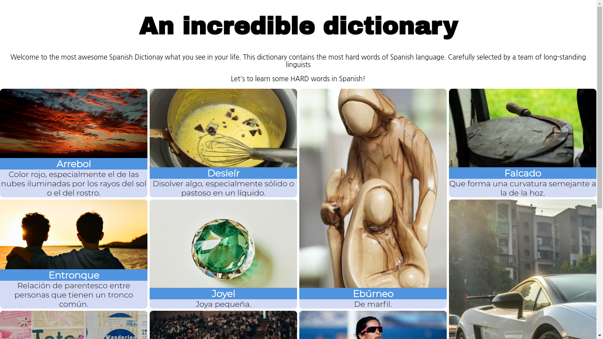

# 🇪🇸Spanish Dictionary 

In this project we are going to build a Dictionary with 10 unknown words of the Spanish language. I hope you enjoy reading it almost as much as I enjoyed building it.
## 🚀DEMO
If you want to learn some HARD words in Spanish you can visit my [website](http://sfd "website") (powered by GitHub pages btw)
## ✨Gratitude 
To my dog how still here wih me ever, even in my moments of absolutly frustration.
## 👀Preview

------------

## 📖References
 [*Real academia española*](https://www.rae.es/ "RAE")
